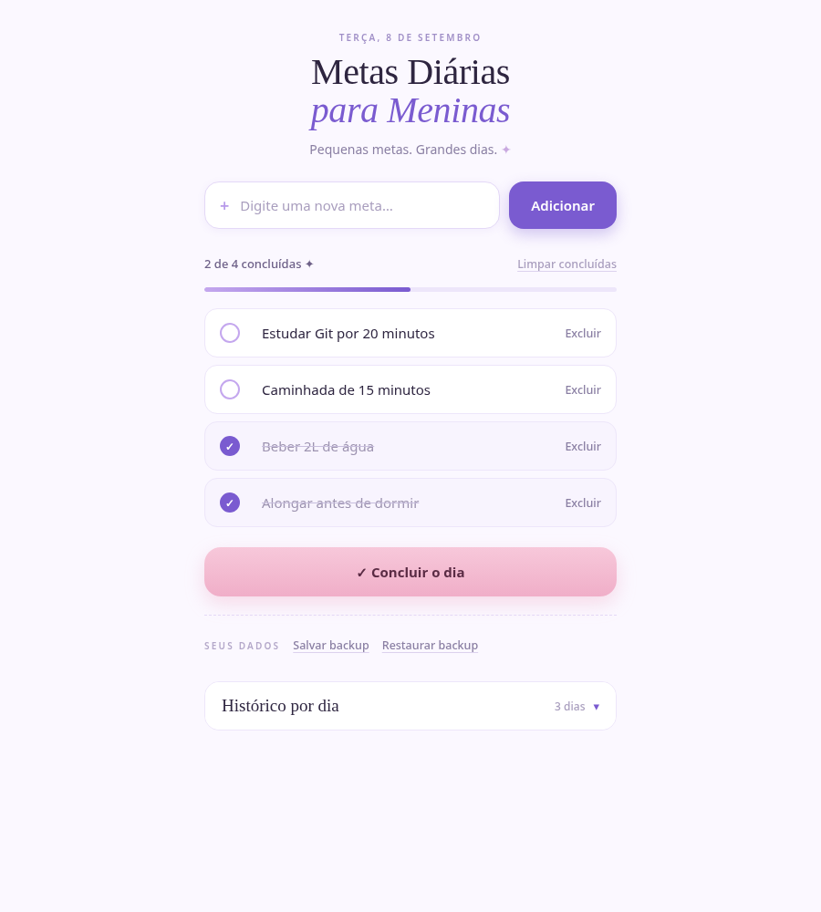

# Metas Diárias para Meninas ✦

**Pequenas metas. Grandes dias.**

Metas Diárias para Meninas é uma ferramenta web simples e leve para organizar pequenas metas do dia, acompanhar tarefas concluídas e manter um histórico pessoal.

O projeto nasceu como um exercício de aprendizagem em HTML, CSS, JavaScript, Git e GitHub e evoluiu para uma pequena ferramenta de produtividade com uma interface delicada e fácil de usar.



## ✦ Funcionalidades

- adicionar metas;
- marcar e desmarcar metas;
- excluir metas;
- limpar concluídas;
- acompanhar o progresso com contador e barra visual;
- concluir o dia e registrá-lo no histórico;
- consultar o histórico por data;
- salvar automaticamente no navegador;
- exportar backup em JSON;
- restaurar um backup;
- usar em desktop ou celular;
- navegar com teclado e recursos básicos de acessibilidade.

## 💜 Salvamento automático

As metas são armazenadas automaticamente no navegador por meio do `localStorage`.

**Não é necessário exportar um arquivo todos os dias.** Enquanto os dados desse navegador não forem apagados, suas metas continuam salvas depois de fechar o navegador ou reiniciar o computador.

O backup em JSON existe como proteção adicional e também permite levar os dados para outro navegador ou computador.

> `localStorage` pertence ao endereço usado para abrir o app. `http://127.0.0.1:8765` e uma futura página no GitHub Pages possuem armazenamentos separados. Para trocar de um ambiente para outro, use **Salvar backup** e depois **Restaurar backup**.

## 💾 Backup

**Salvar backup** baixa um arquivo `.json` com o dia atual, as metas e o histórico.

**Restaurar backup** valida o arquivo antes de substituir os dados locais e recarrega a interface.

## 🖥️ Rodar localmente no Mac

Baixe ou clone o projeto e dê dois cliques em `ABRIR_APP.command`.

Na primeira vez, se o macOS impedir a execução, abra o Terminal na pasta do projeto e rode:

```bash
chmod +x ABRIR_APP.command CRIAR_ATALHO_MAC.command
```

Depois, abra novamente `ABRIR_APP.command`.

O app usa apenas o computador local em:

```text
http://127.0.0.1:8765
```

Para criar um atalho na Mesa, execute `CRIAR_ATALHO_MAC.command` ou siga [docs/INSTALL-MAC.md](docs/INSTALL-MAC.md).

## 🌐 GitHub Pages

O projeto é estático e pode ser publicado diretamente no GitHub Pages, sem backend e sem build.

No repositório: **Settings → Pages → Deploy from a branch → `main` → `/root`**.

## 🎨 Design

A direção visual oficial é **Lavender Girl**: lavanda como cor principal, blush nos momentos de recompensa e bastante espaço em branco.

Detalhes de paleta, tipografia, componentes e acessibilidade estão em [docs/DESIGN.md](docs/DESIGN.md). A estrutura do projeto está explicada em [docs/PROJECT-STRUCTURE.md](docs/PROJECT-STRUCTURE.md).

## 🛠️ Tecnologias

- HTML5
- CSS3
- JavaScript puro
- `localStorage`

Sem framework. Sem backend. Sem build.

## 🤝 Contribuições

Contribuições são bem-vindas. Leia [CONTRIBUTING.md](CONTRIBUTING.md) antes de enviar uma Pull Request.

São especialmente bem-vindas melhorias de:

- acessibilidade;
- correções de bugs;
- UX e responsividade;
- documentação;
- traduções;
- pequenas funcionalidades que preservem a simplicidade do projeto.

## 🔐 Privacidade

Os dados ficam no `localStorage` do navegador. O projeto não possui conta, banco de dados remoto, analytics ou servidor próprio.

Não use a lista para armazenar senhas, tokens, chaves privadas ou informações altamente sensíveis.

## 🚀 Publicação no GitHub

O passo a passo para renomear o repositório, ativar Pages, configurar Topics e preparar a Release está em [docs/PUBLISH-GITHUB.md](docs/PUBLISH-GITHUB.md).

## 📄 Licença

MIT. Veja [LICENSE](LICENSE).
